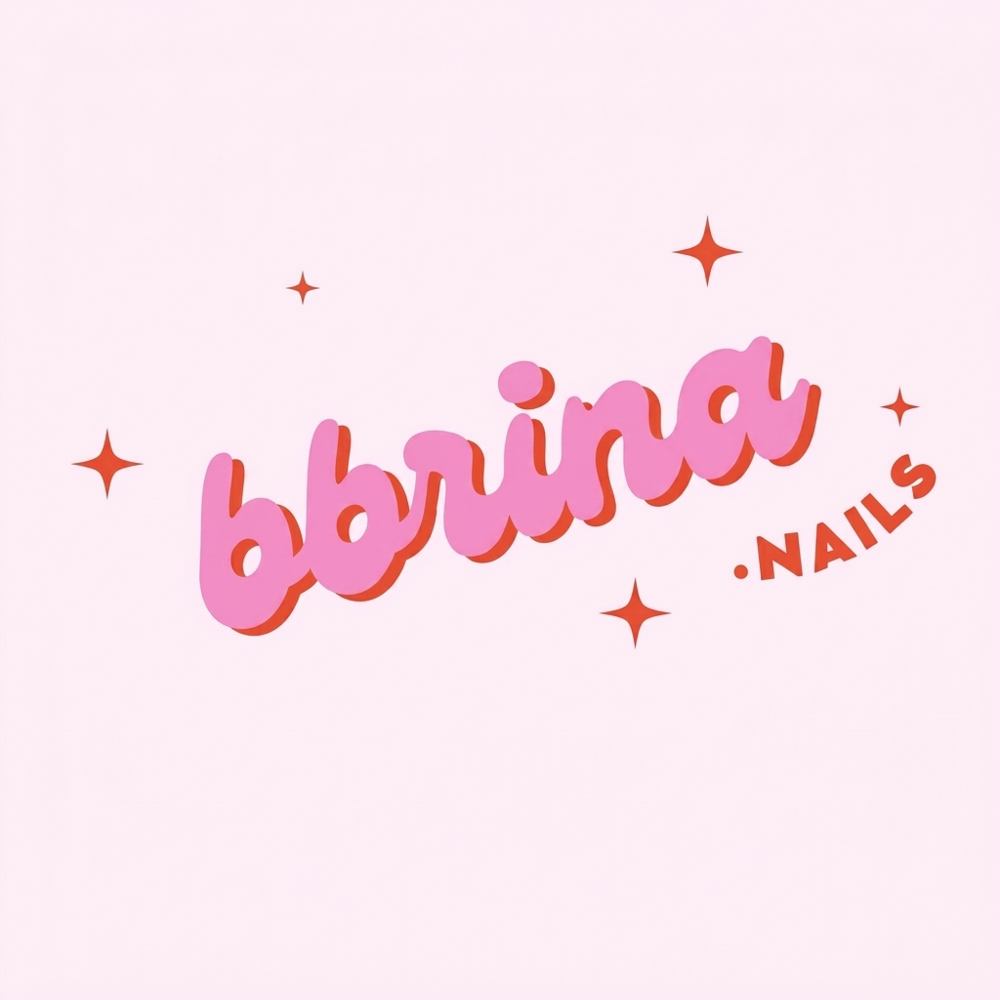

# 💅 bbrina.nails · Turnos

<p align="center">
  
</p>

<p align="center">
  <strong>Sistema web de gestión y reserva de turnos para bbrina.nails</strong>
</p>

<p align="center">
  
  
  
  
</p>

---

## 🌸 Sobre el proyecto

**bbrina.nails · Turnos** es una página web desarrollada para facilitar la reserva y consulta de turnos de un estudio de uñas.

La propuesta busca ofrecer una experiencia simple y visual para que las clientas puedan seleccionar un servicio, elegir una fecha y horario, ingresar sus datos y consultar posteriormente su reserva.

El proyecto también cuenta con un **modo administrador**, destinado a la gestión de las reservas.

---

## ✨ Características

### 💅 Reserva de turnos

El sistema permite realizar una reserva mediante un proceso dividido en pasos:

1. Selección del servicio.
2. Selección de fecha y horario.
3. Ingreso de datos de la clienta.
4. Selección opcional de una seña.
5. Revisión de la información.
6. Confirmación de la reserva.

Al finalizar, se genera un **código de reserva** que permite consultar posteriormente el turno.

---

### 🔎 Consulta de turnos

Las reservas pueden consultarse ingresando:

* 📱 Número de WhatsApp.
* 🔢 Código de reserva.

Desde esta sección también se puede acceder a las opciones disponibles para gestionar el turno.

---

### 👩‍💼 Panel de administrador

El proyecto cuenta con un panel independiente para la administración de las reservas.

Desde el panel se pueden:

* 📋 Visualizar las reservas.
* ✏️ Editar reservas.
* 🔄 Mover reservas de fecha u horario.
* ❌ Cancelar reservas.
* 🔒 Bloquear horarios.
* 📊 Consultar reservas recientes y generales.
* 📁 Exportar reservas en formato CSV.
* 🔐 Iniciar y cerrar sesión de administrador.

---

### 📱 Contacto

La página integra accesos directos a:

* 💬 WhatsApp.
* 📸 Instagram.

También utiliza WhatsApp como medio de confirmación y comunicación relacionado con las reservas.

---

### 🎨 Diseño

La interfaz está orientada a una estética elegante y femenina, utilizando:

* Diseño responsive.
* Secciones visuales.
* Tarjetas.
* Formularios por pasos.
* Modales.
* Iconos SVG.
* Animaciones y efectos visuales.
* Tipografías obtenidas desde Google Fonts.

---

## 💅 Servicios disponibles

Actualmente, el proyecto contempla los siguientes servicios:

| Servicio                | Duración |
| ----------------------- | -------: |
| 💅 Kapping              |   90 min |
| ✨ Semipermanente        |   60 min |
| 💎 Esculpidas           |  120 min |
| 🧴 Retiro + nuevo       |   90 min |
| 🌸 Spa de manos         |   45 min |
| 🎨 Diseño personalizado |   30 min |

> Los servicios y horarios se encuentran definidos en la configuración del proyecto y pueden modificarse según las necesidades de bbrina.nails.

---

## 🛠️ Tecnologías utilizadas

### HTML5

Utilizado para la estructura y contenido de las páginas web.

### CSS3

Utilizado para el diseño visual, responsive, componentes, formularios, tarjetas, modales y diferentes elementos de la interfaz.

### JavaScript

Utilizado para la lógica del sistema, interacción con formularios, selección de servicios, fechas y horarios, gestión de reservas y funcionamiento del panel administrativo.

### Supabase

Utilizado como servicio de almacenamiento y gestión de las reservas mediante operaciones sobre la base de datos.

---

## 📁 Estructura del proyecto

```text
bbrina.nails-Turnos/
│
├── assets/
│   ├── logo.jpeg
│   ├── sabrina.jpeg
│   └── ...
│
├── index.html
├── admin.html
│
├── styles.css
│
├── script.js
├── admin.js
├── login.js
└── supabase.js
```

### 📄 Archivos principales

| Archivo       | Función                                   |
| ------------- | ----------------------------------------- |
| `index.html`  | Página principal y sistema de reserva     |
| `admin.html`  | Panel de administración                   |
| `styles.css`  | Estilos y diseño visual                   |
| `script.js`   | Lógica principal de reservas              |
| `admin.js`    | Lógica del panel administrativo           |
| `login.js`    | Inicio de sesión administrativo           |
| `supabase.js` | Conexión y operaciones con Supabase       |
| `assets/`     | Recursos gráficos utilizados por el sitio |

---

## 🚀 Uso del proyecto

El proyecto está compuesto por archivos HTML, CSS y JavaScript y no contiene un sistema de construcción basado en Node.js, npm u otro gestor de paquetes.

Para visualizar la interfaz principal se utiliza:

```text
index.html
```

El panel administrativo se encuentra en:

```text
admin.html
```

La configuración de los servicios, horarios y otros parámetros principales se encuentra dentro de `script.js`.

---

## 🗄️ Gestión de datos

El proyecto utiliza **Supabase** para almacenar y gestionar información relacionada con las reservas.

Entre las operaciones implementadas se encuentran:

* Crear reservas.
* Consultar reservas.
* Actualizar reservas.
* Eliminar reservas.
* Gestionar bloqueos de horarios.

La comunicación con Supabase se centraliza en:

```text
supabase.js
```

---

## 📸 Vista del proyecto

### Página principal

La página principal presenta la identidad de **bbrina.nails**, información del estudio, acceso a reservas, consulta de turnos, preguntas frecuentes y otros contenidos relacionados.

### Sistema de reservas

El proceso de reserva utiliza una interfaz paso a paso para seleccionar el servicio, fecha, horario y datos de la clienta.

### Panel administrativo

El panel permite gestionar las reservas desde una interfaz independiente.

---

## 📌 Estado del proyecto

**Proyecto en desarrollo.**

La estructura actual contiene el sistema de reservas, consulta de turnos, panel administrativo, autenticación y conexión con Supabase.

---

## 👨‍💻 Autor

**Fabrigrotta**

GitHub:
https://github.com/Fabrigrotta

---

## 🔗 Repositorio

<p align="center">
  <a href="https://github.com/Fabrigrotta/bbrina.nails-Turnos">
    <strong>Ver repositorio en GitHub</strong>
  </a>
</p>

---

<p align="center">
  💅 <strong>bbrina.nails</strong> · Turnos
  <br>
  <sub>Una experiencia simple para reservar tu momento.</sub>
</p>
